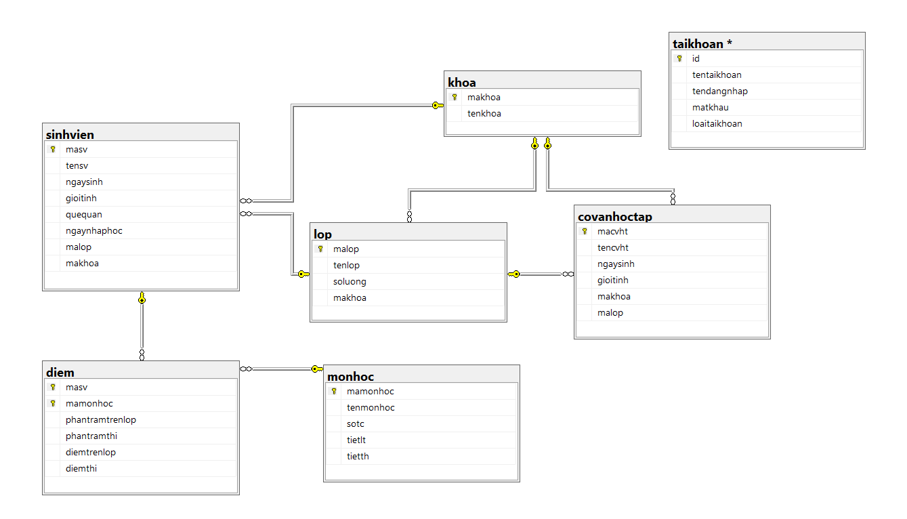
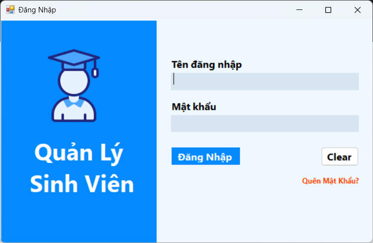
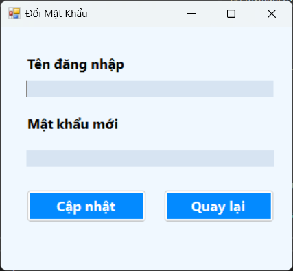
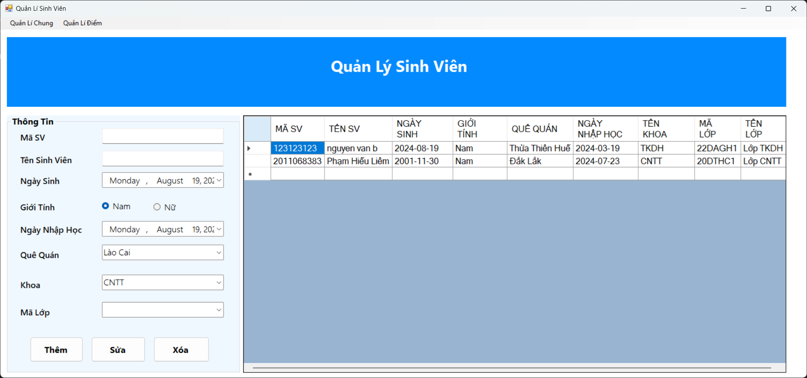
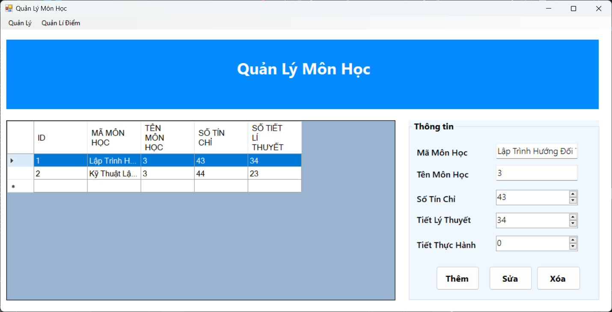
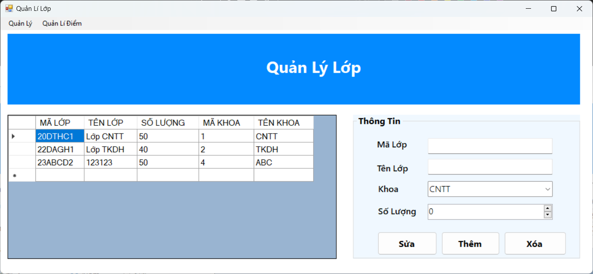
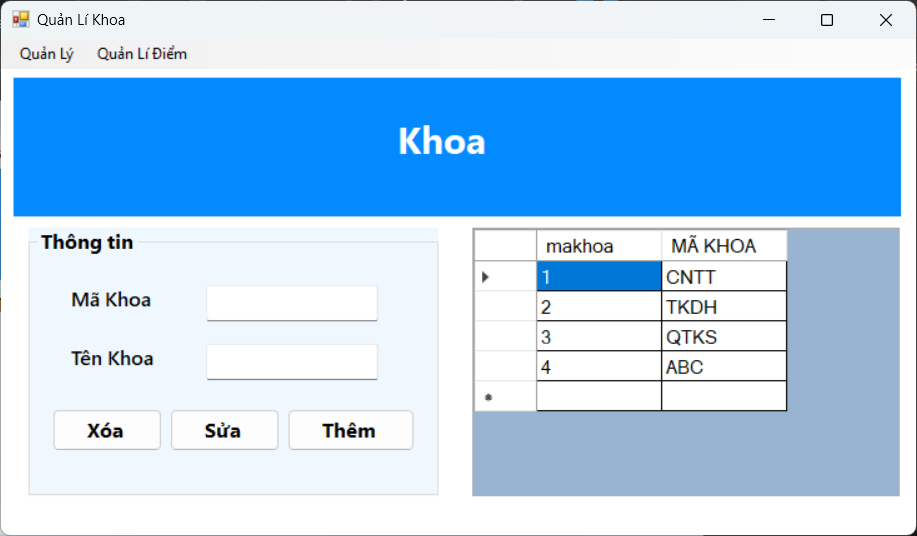
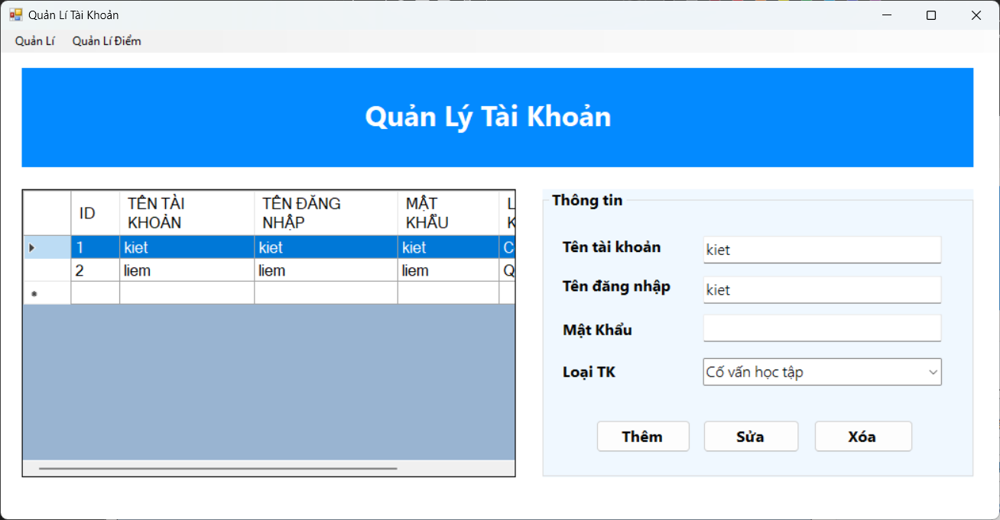
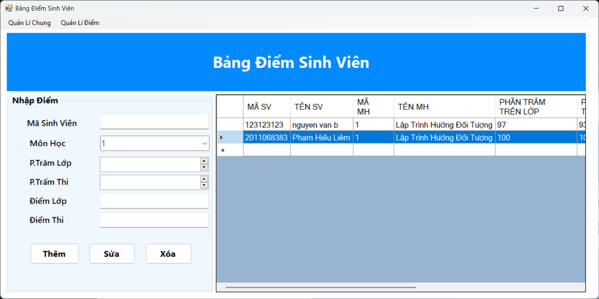
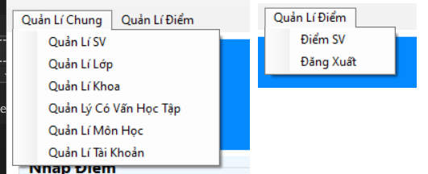

# Student Management Application

This is a simple Windows Forms application written in C# for managing student information, courses, grades, and user accounts. The application is designed to facilitate the management of student records and related activities in an educational environment.


## Features

- **Student Management**: Add, update, delete, and view student records.
- **Course Management**: Manage courses and subjects.
- **Class Management**: Handle class details and assignments.
- **Grade Management**: Input and view student grades.
- **Account Management**: Manage user accounts and permissions.
- **Login System**: Secure login with the ability to change passwords.

   


## Screenshots

1. **Login Screen**  
   

2. **Change Password Screen**  
   

3. **Student Management Screen**  
   

4. **Course Management Screen**  
   

5. **Class Management Screen**  
   

6. **Department Management Screen**  
   

7. **Grade Management Screen**  
   

8. **Account Management Screen**  
   

9. **Grade Report Screen**  
   

10. **Navigation Menu**  
    

## Prerequisites

- .NET Framework 4.7.2 or higher
- Visual Studio 2019 or higher

## Getting Started

1. Clone the repository:
   
   ```bash
   git clone https://github.com/kietdang8856/REUP_QuanLySinhVien_WinformCsharp

2. Open the solution in Visual Studio.
3. Rename the database in source code.
4. Build the solution to restore the necessary packages.
5. Run the application by pressing F5.
